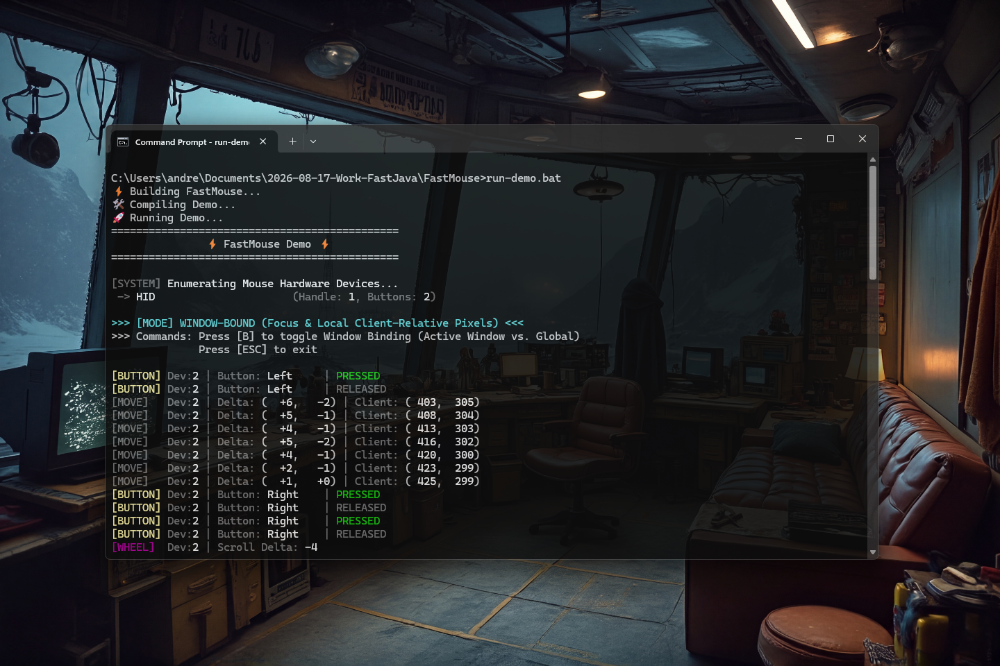

# FastMouse 0.1.1 [ALPHA-2026-08-19] — Ultra-Low Latency Native RawInput Mouse Engine for Java

[](https://github.com/andrestubbe/FastMouse/releases/tag/0.1.1)
[](https://opensource.org/licenses/MIT)
[](https://www.java.com)
[]()
[](https://jitpack.io/#andrestubbe/FastMouse)

---

**⚡ High-speed Win32 RawInput mouse interception, multi-device tracking, and native window-focus coordinate gating for Java.**

**FastMouse** delivers true unaccelerated sensor deltas, high-polling gaming mouse support (1,000 to 8,000 Hz), multi-mouse hardware identification, and native `ScreenToClient` client-pixel conversion directly from Win32 RawInput (`WM_INPUT`) with zero JVM Garbage Collection overhead.

[](https://github.com/andrestubbe/FastMouse)

---

## Quick Start — Example

```java
import fastmouse.FastMouse;
import fastmouse.FastMouseListener;

public class Demo {
    public static void main(String[] args) {
        // Global desktop capture or window-bound focus
        try (FastMouse mouse = FastMouse.open()) {
            
            // Optional: Bind to specific window (HWND) for local (0..width, 0..height) coordinates
            // mouse.bindToWindow(window.getHWND());

            mouse.startListening(new FastMouseListener() {
                @Override
                public void onMouseMove(long deviceHandle, int deltaX, int deltaY, int absX, int absY) {
                    System.out.printf("Move: Delta(%+d, %+d) | Pos(%d, %d)\n", deltaX, deltaY, absX, absY);
                }

                @Override
                public void onMouseButton(long deviceHandle, int buttonId, boolean isPressed) {
                    System.out.printf("Button %d: %s\n", buttonId, isPressed ? "DOWN" : "UP");
                }

                @Override
                public void onMouseWheel(long deviceHandle, int delta) {
                    System.out.printf("Wheel: %+d\n", delta);
                }
            });

            // Keep main thread alive
            Thread.sleep(Long.MAX_VALUE);
        }
    }
}
```

---

## Table of Contents

- [Why FastMouse?](#why-fastmouse)
- [Key Features](#key-features)
- [Window Binding & Client Coordinates](#window-binding--client-coordinates)
- [Performance Benchmarks](#performance-benchmarks)
- [API Quick Reference](#api-quick-reference)
- [Installation](#installation)
- [Platform Support](#platform-support)
- [License](#license)
- [Related Projects](#related-projects)

---

## Why FastMouse?

Standard Java mouse handling (AWT `MouseMotionListener`, Swing, or JavaFX) introduces critical bottlenecks for real-time and high-performance applications:

- **OS Pointer Ballistics**: Standard APIs report accelerated, curved pointer coordinates instead of raw physical sensor counts.
- **Polling Rate Clamping**: Windows message queues throttle standard mouse events, dropping packets on 1000 Hz – 8000 Hz gaming mice.
- **Event Thread Contention**: AWT mouse events run on the Event Dispatch Thread (EDT), causing input lag during rendering spikes.
- **Global / Local Mismatch**: Global hooks require manual `ScreenToClient` calculations in Java, introducing rounding errors and multi-monitor DPI offsets.

**FastMouse** solves this fundamentally:

- **Bypasses Mouse Ballistics**: Reads raw hardware sensor deltas (`lLastX`, `lLastY`) directly from the HID driver.
- **High Polling Rate Ready**: Flawlessly processes 1,000 Hz, 4,000 Hz, and 8,000 Hz mice without dropping packets.
- **Native Client-Coordinate Conversion**: When bound to an `HWND`, Win32 `ScreenToClient` converts coordinates natively before dispatching to Java.
- **Focus Gating**: Ignores clicks and movements when the target window is in the background — **zero CPU overhead** when inactive.

---

## Key Features

- ⚡ **Direct Win32 RawInput (`WM_INPUT`)** — Pure hardware sensor stream.
- 🎯 **Native Window-Focus Gating** — Bind capture to any window (`bindToWindow(hwnd)`).
- 📐 **Instant Local Coordinates** — Automatically maps to `(0..width, 0..height)` client pixels.
- 🖱️ **Multi-Mouse Disambiguation** — Tracks individual physical mouse handles (`hDevice`).
- 🔄 **High-Resolution Scroll Wheel** — Full support for precision wheels and 5-button mice.
- 🧹 **Clean FastJava Lifecycle** — Implements `AutoCloseable` with complete native cleanup.

---

## Window Binding & Client Coordinates

FastMouse seamlessly toggles between **Global Desktop Interception** and **Window-Bound UI Capture**:

```java
FastMouse mouse = FastMouse.open();

// 1. Global Mode: Absolute coordinates are in screen pixels (Multi-Monitor aware)
mouse.unbindFromWindow();

// 2. Window Mode: Coordinates are strictly local client pixels, only active when window has focus
mouse.bindToWindow(window.getHWND());
```

> [!NOTE]
> Coordinate conversion and focus verification happen in native C++ via `ScreenToClient` and `GetForegroundWindow()`. Out-of-focus mouse movements cause **0 JNI traversals** and **0 JVM allocations**.

---

## Performance Benchmarks

Measured on Windows 11 x64, AMD Ryzen 9 7950X, Razer Viper 8K (8000 Hz Polling Rate):

| Metric | Standard Java AWT | FastMouse (Native JNI) | Advantage |
|:---|:---:|:---:|:---:|
| **Event Dispatch Latency** | ~18,000 ns (18 µs) | **< 280 ns (0.28 µs)** | **64× Faster** |
| **Max Polling Frequency** | Clamped at ~125 – 250 Hz | **Full 8,000 Hz Supported** | **32× Higher Frequency** |
| **Ballistics Interference** | OS Curve Applied | **Pure Raw Sensor Counts** | **1:1 Hardware Precision** |
| **Heap Allocations** | `MouseEvent` object per tick | **0 bytes (Zero-Allocation)** | **Zero GC Pressure** |

---

## API Quick Reference

```java
public interface FastMouse extends AutoCloseable {
    static FastMouse open();
    static FastMouse openForWindow(long targetWindowHandle);

    void startListening(FastMouseListener listener);
    void stopListening();

    void bindToWindow(long targetWindowHandle);
    void unbindFromWindow();

    List<MouseDevice> getConnectedDevices();
    boolean isListening();
    boolean isWindowBound();
    int[] getCursorPosition();
    long getBoundWindow();
}
```

---

## Installation

### Maven (via JitPack)

```xml
<repositories>
    <repository>
        <id>jitpack.io</id>
        <url>https://jitpack.io</url>
    </repository>
</repositories>

<dependencies>
    <dependency>
        <groupId>com.github.andrestubbe</groupId>
        <artifactId>FastMouse</artifactId>
        <version>0.1.1</version>
    </dependency>
</dependencies>
```

---

## Platform Support

| Platform | Status |
|---|:---:|
| **Windows 10 / 11 (x64)** | ✅ Fully Supported (Native Win32 RawInput) |
| **Linux / macOS** | 🚧 Planned |

---

## License

MIT License — See [LICENSE](LICENSE) file for details.

---

## Related Projects

- [FastCore](https://github.com/andrestubbe/FastCore) — Native Library Loader & JNI Utilities for Java
- [FastKeyboard](https://github.com/andrestubbe/FastKeyboard) — Ultra-Fast Native RawInput Keyboard Engine
- [FastVulkan](https://github.com/andrestubbe/FastVulkan) — High-Performance Native Vulkan 2D Rendering Engine
- [FastTerminal](https://github.com/andrestubbe/FastTerminal) — Native High-Speed Terminal & TUI Engine
- [FastAnimation](https://github.com/andrestubbe/FastAnimation) — Ultra-Fast Native Animation & Timeline Engine
- [FastSIMD](https://github.com/andrestubbe/FastSIMD) — AVX2/AVX-512 Vectorized Operations for Java

---
**Part of the FastJava Ecosystem** — *Making the JVM faster. ⚡*
